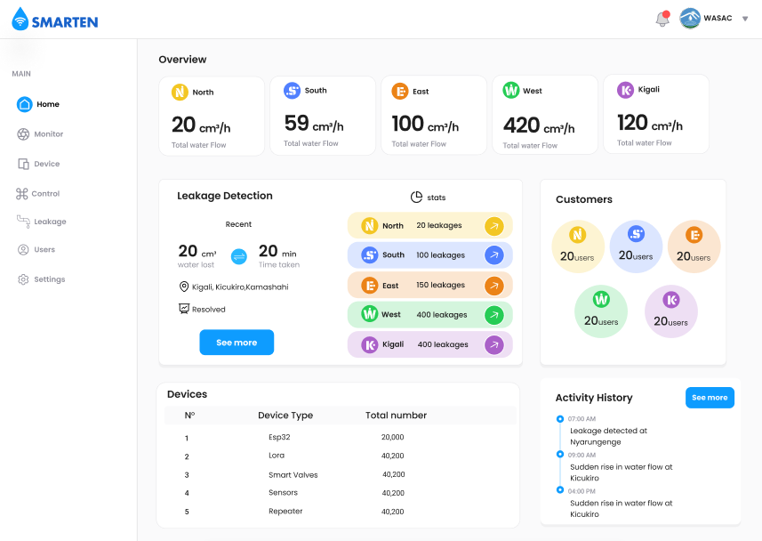

# Ivan's Portfolio

 *A modern, responsive, and dynamic personal portfolio built with React and TypeScript.*

## 👨‍💻 Author

**MUCYO Ivan**
*Fullstack Developer | Software Engineer | UI/UX Enthusiast*

- **GitHub:** [@Mucyo-Ivan](https://github.com/Mucyo-Ivan)
- **LinkedIn:** [MUCYO Ivan](https://www.linkedin.com/in/mucyo-yvan-0633bb3b0)
- **X (Twitter):** [@\_Mucyo\_](https://x.com/_Mucyo_)

---

## 🌟 About the Project

This is my official personal portfolio website, designed to showcase my journey, skills, education, and the diverse range of projects I have built. It serves as a central hub for anyone looking to connect with me professionally, view my resume, or explore my technical work. 

The portfolio features a clean, modern aesthetic with glassmorphism elements, dynamic typing animations, and highly responsive layouts that work flawlessly across all devices.

### Key Features
- **Dynamic Home Page:** Features a striking introductory section with a self-updating age calculator, a live typing animation of my roles, and quick access to download my resume.
- **Skills & Education:** A beautifully structured timeline and progress bar layout highlighting my technical proficiencies and academic background.
- **Projects Showcase:** An interactive portfolio gallery divided horizontally into **Web Development** and **Software & IoT**. Features automated endless scrolling carousels, hover effects, and direct links to GitHub repositories for projects like *SMARTEN*, *Rwalent*, *Face Locking System*, and more.
- **Interactive Contact Form:** A fully functional, validated contact section to get in touch directly.
- **Testimonials & Hobbies:** Personal touches that highlight what others say about my work ethic and what I enjoy outside of coding.

## 🛠️ Built With

This project was built from the ground up using modern web technologies to ensure blazing fast performance and a stellar developer experience.

- [React](https://reactjs.org/) - Component-based UI library
- [TypeScript](https://www.typescriptlang.org/) - Strongly typed programming language
- [Vite](https://vitejs.dev/) - Next-generation frontend tooling and bundler
- [React Router DOM](https://reactrouter.com/) - Declarative routing for React
- [Typed.js](https://github.com/mattboldt/typed.js/) - Animated typing library
- [CSS3](https://developer.mozilla.org/en-US/docs/Web/CSS) - Custom styling with Flexbox, CSS Grid, and Keyframe animations
- [FontAwesome 6 (CDN)](https://fontawesome.com/) - Scalable vector icons

## 🚀 Getting Started

If you'd like to run this portfolio locally on your machine, follow these steps:

### Prerequisites
Make sure you have [Node.js](https://nodejs.org/) installed on your machine.

### Installation

1. **Clone the repository:**
   ```bash
   git clone https://github.com/Mucyo-Ivan/My-Official-Portfolio.git
   ```
2. **Navigate to the project directory:**
   ```bash
   cd My-Official-Portfolio
   ```
3. **Install the dependencies:**
   ```bash
   npm install
   ```
4. **Start the development server:**
   ```bash
   npm run dev
   ```
5. **Open your browser:**
   Navigate to `http://localhost:5173` to see the portfolio live!

## 🤝 Contributing

Contributions, issues, and feature requests are welcome! Feel free to check the [issues page](https://github.com/Mucyo-Ivan/My-Official-Portfolio/issues). 

## 📝 License

This project is open-source and available under the [MIT License](LICENSE). 

---

*Designed and developed with ❤️ by **MUCYO Ivan**.*
